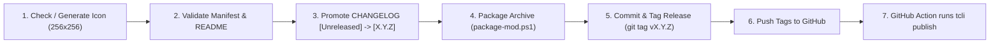

# Publish Mod (Automated Thunderstore Release)

This skill guides agents and developers through preparing, tagging, and publishing a R.E.P.O. BepInEx mod to [Thunderstore](https://thunderstore.io/) using GitHub Actions and the official Thunderstore CLI (`tcli`).

---

## Release Pipeline Overview



---

## One-Time Setup: GitHub Repository Secret

Before publishing via GitHub Actions for the first time, add your **Thunderstore API Token** to your GitHub repository secrets:

1. Log in to [Thunderstore.io](https://thunderstore.io).
2. Navigate to **Settings → Teams → [Your Team] → Service Accounts**.
3. Click **Add service account** and copy the generated API token.
4. Open your mod's GitHub repository: **Settings → Secrets and variables → Actions → New repository secret**.
5. Name: `THUNDERSTORE_TOKEN`
6. Value: *(Paste your API Token)*

---

## Pre-Release Checklist (Executed automatically by script)

1. **Thumbnail Check (`icon.png`):**
   - Verifies `icon.png` is exactly 256x256 pixels. If missing or invalid, automatically runs `generate-procedural-icon.ps1` to generate a high-contrast theme badge.
2. **Manifest & README Validation:**
   - Ensures `website_url` is present in `manifest.json` (auto-detected from `git remote origin` if missing).
   - Verifies `manifest.json` has a clear, informative `description` (< 250 characters).
   - Ensures `README.md` contains the mandatory `## Issues & Bug Reports` section pointing to GitHub Issues.
3. **Changelog Promotion (`CHANGELOG.md`):**
   - Automatically converts the development `## [Unreleased]` section header into `## [X.Y.Z] - YYYY-MM-DD`.
4. **Version Synchronization:**
   - Synchronizes version number across `<Version>` in `.csproj`, `version_number` in `manifest.json`, and `PluginVersion` in `[ModName]Plugin.cs`.
5. **GitHub Workflow Injection:**
   - Ensures `.github/workflows/publish.yml` is present in the mod repository.

---

## Automated Execution

### Option 1: PowerShell Automation Script (Recommended)

Run `publish-mod.ps1` from the mod repository root:

```powershell
powershell -ExecutionPolicy Bypass -File external/RepoKit/skills/publish-mod/scripts/publish-mod.ps1 `
  -ModPath . `
  -Version 1.0.0
```

**Parameters:**
- `-ModPath`: Target mod root directory (default `.`).
- `-Version`: Optional explicit version string (e.g. `1.1.0`). If omitted, uses current manifest version.
- `-SkipPush`: Prepares release, packages zip, and tags `vX.Y.Z` locally without pushing to GitHub.
- `-LocalPublish`: Directly executes `tcli publish` on your local machine using `$env:THUNDERSTORE_TOKEN`.

---

## Output Verification

After pushing tags, verify execution:

1. Open your GitHub Repository → **Actions** tab.
2. Observe the `Publish to Thunderstore` workflow running.
3. Once completed, visit your package page on Thunderstore to verify the release upload.
