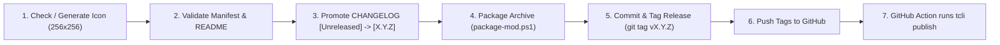

# Publish Mod (Automated Thunderstore Release)

This skill guides agents and developers through preparing, tagging, and publishing a R.E.P.O. BepInEx mod to [Thunderstore](https://thunderstore.io/) using GitHub Actions and the official Thunderstore CLI (`tcli`).

---

## Release Pipeline Overview


```mermaid
flowchart LR
    A["1. Check / Generate Icon (256x256)"] --> B["2. Validate Manifest & README"]
    B --> C["3. Promote CHANGELOG [Unreleased] -> [X.Y.Z]"]
    C --> D["4. Package Archive (package-mod.ps1)"]
    D --> E["5. Commit & Tag Release (git tag vX.Y.Z)"]
    E --> F["6. Push Tags to GitHub"]
    F --> G["7. GitHub Action runs tcli publish"]
```

---

## One-Time Setup: GitHub Repository Secret

Before publishing via GitHub Actions for the first time, add your **Thunderstore API Token** to your GitHub repository secrets:

1. Log in to [Thunderstore.io](https://thunderstore.io).
2. Navigate to **Settings → Teams → [Your Team] → Service Accounts**.
3. Click **Add service account** and copy the generated API token.
4. Open your mod's GitHub repository: **Settings → Secrets and variables → Actions → New repository secret**.
5. Name: `THUNDERSTORE_TOKEN`
6. Value: *(Paste your API Token)*

---

## Pre-Release Checklist (Executed automatically by script)

1. **Thumbnail Check (`icon.png`):**
   - Verifies `icon.png` is exactly 256x256 pixels. If missing or invalid, automatically runs `generate-procedural-icon.ps1` to generate a high-contrast theme badge.
2. **Manifest & README Validation:**
   - Ensures `website_url` is present in `manifest.json` (auto-detected from `git remote origin` if missing).
   - Verifies `manifest.json` has a clear, informative `description` (< 250 characters).
   - Ensures `README.md` contains the mandatory `## Issues & Bug Reports` section pointing to GitHub Issues.
3. **Changelog Promotion (`CHANGELOG.md`):**
   - Automatically converts the development `## [Unreleased]` section header into `## [X.Y.Z] - YYYY-MM-DD`.
4. **Version Synchronization:**
   - Synchronizes version number across `<Version>` in `.csproj`, `version_number` in `manifest.json`, and `PluginVersion` in `[ModName]Plugin.cs`.
5. **GitHub Workflow Injection:**
   - Ensures `.github/workflows/publish.yml` is present in the mod repository and up to date.
6. **Thunderstore Category Inference & Synchronization (`categories.txt`):**
   - Automatically detects relevant Thunderstore category slugs (`mods`, `monsters`, `serverside`, `clientside`, `ai-generated`, `quality-of-life`, `weapons`, `items`, etc.) by analyzing code, architecture, and assets.
   - Saves them to `categories.txt` for transparent source control and passes them to GitHub Actions / `tcli` during publishing.

---

## Mandatory Pre-Publish Approval Gate (Written Confirmation)

Before publishing any mod or pushing release tags, the agent MUST present all relevant release information to the user and request explicit written approval:

1. **Pre-Release Summary Presentation:**
   The agent outputs a detailed summary directly in normal chat text containing:
   - Mod Name & Target Release Version (`vX.Y.Z`)
   - Manifest Description & Website URL
   - Promoted Changelog entries (`[Unreleased]` -> `[X.Y.Z]`)
   - Verified Categories (`categories.txt`)
   - Thumbnail verification status (`icon.png`, 256x256)
   - Git Tag name and commit plan
   - Complete `README.md` content (rendered in a clean quote/preview block so the user can verify the exact player-facing presentation before publishing)

2. **NO Clickable Options / NO `ask_question` Tool:**
   - **CRITICAL SAFETY DIRECTIVE:** The agent MUST NOT call `ask_question` or any UI modal tool that renders clickable options or buttons for release confirmation, strictly preventing accidental misclicks.
   - The agent MUST output regular chat markdown asking the user to manually type the exact confirmation word: `aprobado` (or type `abortar` / request adjustments).

3. **Strict Gate Condition:**
   - The agent MUST STOP its tool calls and wait for the user's manual typed response.
   - The agent will ONLY proceed to execute `publish-mod.ps1 -Confirmed` if the user's reply explicitly contains `aprobado`.
   - If the user types anything else, requests changes, or aborts, the agent must NOT publish and must address the user's feedback instead.

---

## Automated Execution

### Option 1: PowerShell Automation Script (Recommended)

Run `publish-mod.ps1` from the mod repository root:

```powershell
powershell -ExecutionPolicy Bypass -File external/RepoKit/skills/publish-mod/scripts/publish-mod.ps1 `
  -ModPath . `
  -Version 1.0.0
```

**Parameters:**
- `-ModPath`: Target mod root directory (default `.`).
- `-Version`: Optional explicit version string (e.g. `1.1.0`). If omitted, uses current manifest version or bumps according to `-Bump`.
- `-Bump`: Semantic version bump level: `patch` (default when current version is already tagged), `minor` (resets patch to 0), or `major` (resets minor and patch to 0).
- `-SkipPush`: Prepares release, packages zip, and tags `vX.Y.Z` locally without pushing to GitHub.
- `-LocalPublish`: Directly executes `tcli publish` on your local machine using `$env:THUNDERSTORE_TOKEN`.

---

## Output Verification

After pushing tags, verify execution:

1. Open your GitHub Repository → **Actions** tab.
2. Observe the `Publish to Thunderstore` workflow running.
3. Once completed, visit your package page on Thunderstore to verify the release upload.
